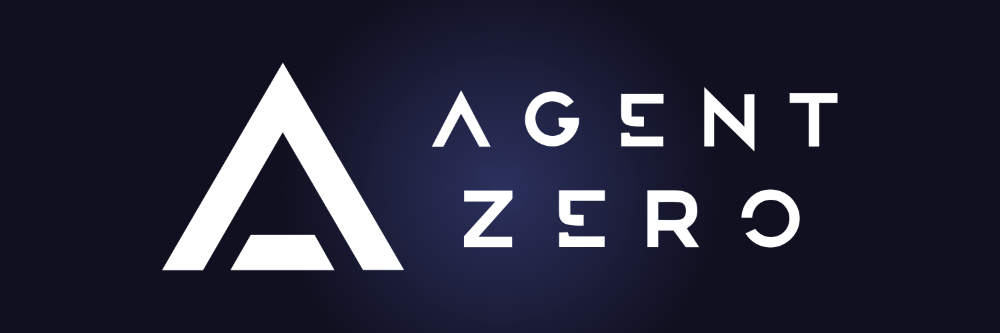
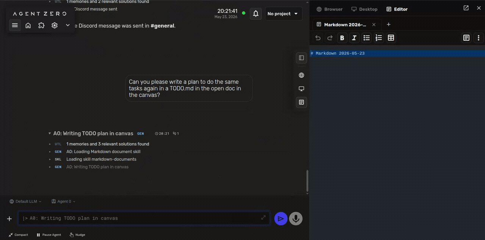
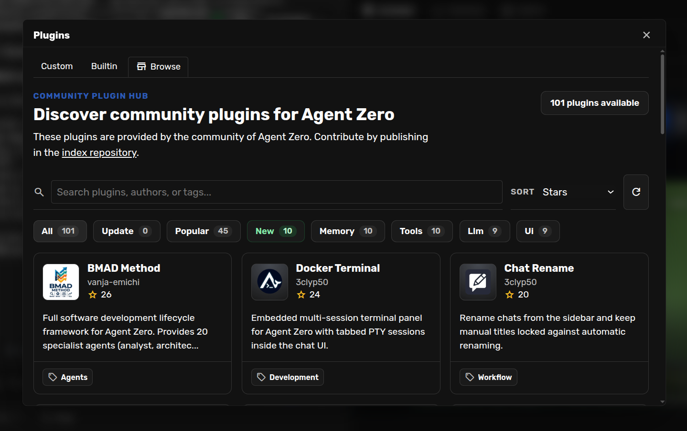
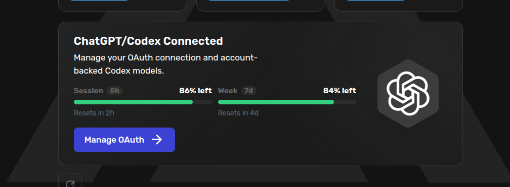
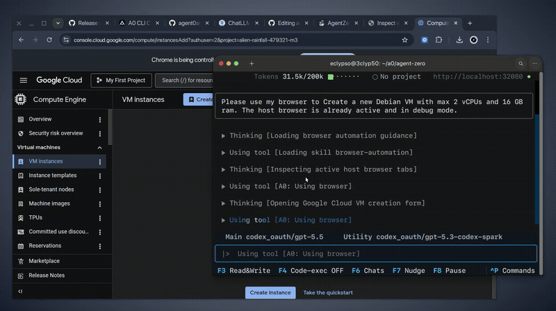

<div align="center">



# Agent Zero
### A full Linux system for your AI agent.

Agent Zero is an open, dynamic, organic agentic framework. One Docker container ships a full Linux system with a desktop and a plugin hub that the agent can extend using Skills.

[](https://agent-zero.ai)
[](./docs/)
[](https://discord.gg/B8KZKNsPpj)
[](https://github.com/sponsors/agent0ai)

[Install](#how-to-install) |
[Launcher](#agent-zero-launcher) |
[What's Different](#what-makes-agent-zero-different) |
[A0 CLI](#a0-cli-connector-extend-onto-your-host-machine) |
[Docs](#documentation)

[](https://deepwiki.com/agent0ai/agent-zero)
[Ask ChatGPT](https://chatgpt.com/?q=Analyze%20this%3A%20https%3A%2F%2Fgithub.com%2Fagent0ai%2Fagent-zero) |
[Ask Claude](https://claude.ai/new?q=Analyze%20this%3A%20https%3A%2F%2Fgithub.com%2Fagent0ai%2Fagent-zero)


</div>

<div align="center">
<a href="https://www.youtube.com/watch?v=k78HX_RA9Q0&t=19s">

</a>
</div>

# What Makes Agent Zero Different

## How To Install

### Agent Zero Launcher

Starting fresh on a new machine? Use the desktop **Agent Zero Launcher** if you want a guided app instead of manual Docker commands.

Download the Launcher from the [A0 Launcher releases](https://github.com/agent0ai/a0-launcher/releases), open it, and let it check your local runtime. If Docker is missing or stopped, the Launcher offers a setup path before it downloads Agent Zero. If you already host Agent Zero elsewhere, add it as a remote Instance and use the Launcher without local Docker setup.

See the [Agent Zero Launcher guide](./docs/guides/launcher.md) for the first-run walkthrough, screenshots, and the Playwright/Electron capture recipe used for documentation.

### macOS / Linux

```bash
curl -fsSL https://bash.agent-zero.ai | bash
```

### Windows PowerShell

```powershell
irm https://ps.agent-zero.ai | iex
```

### Docker already installed? Run this directly

```bash
docker run -p 80:80 -v a0_usr:/a0/usr agent0ai/agent-zero
```

Open the Web UI, configure your LLM provider, and start with a concrete task. For the full setup and onboarding experience, see the [Installation guide](./docs/setup/installation.md).

## A Real Linux Desktop in the Canvas


<br>

Agent Zero opens its own Linux desktop inside the right-side Canvas. Not a remote VM, not a shared clipboard, but a real XFCE desktop session running in the container.

That means the agent can drive *real desktop software*: open Blender to model a 3D object, jump into a terminal window, manage files visually, run a GUI tool that has no API.

You watch every action, and you can intervene at any moment because your mouse and keyboard share the same desktop.

See the [Desktop guide](./docs/guides/desktop.md) for the walkthrough, prompt examples, and how Desktop differs from Browser.

## Native Browser With DOM Annotations


<br>

Agent Zero ships a built-in Browser with an optional live surface in the Canvas. The agent can open pages, read them, click, type, upload files, and take screenshots - the usual. The unusual part is **Annotate mode**.

Annotate mode turns any webpage into an interactive directive surface. Click an element to:

- **Change it** - "make this button blue and round the corners" runs as a JS instruction the agent applies and verifies.
- **Inspect it** - pull the DOM, the styles, the parent chain, the framework hints into the conversation.
- **Lift it** - see a card, hero, or component on someone else's site that you like? Capture it and have the agent re-implement it in your own project's stack.
- **Comment it** - leave actionable notes pinned to elements during a UI review; the agent reads the comments and ships the fixes.

The Docker browser is the default live Browser surface. Browser history keeps screenshots of important steps, so older chats can still show what the agent saw. The Browser also supports Chrome extensions inside the Docker browser, and **Bring Your Own Browser** through the A0 CLI Connector lets the agent drive Chrome/Edge/Chromium on your own machine.

See the [Browser guide](./docs/guides/browser.md) for screenshots, settings, host-browser setup, and troubleshooting.

## Cowork on Documents

### Markdown Editor With Live Cowork


<br>

The Canvas includes a rich Markdown editor designed for genuine cowork. Ask the agent to "write a plan to do X in a TODO.md in the open doc" and you'll see the file appear in the editor, character by character, while you keep typing in another section.

It's not a preview pane. It's a real editor with toolbar, formatting buttons, tables, and an editable source view - built so that the agent's edits and yours are equal first-class operations on the same document.

Use it for plans, TODOs, meeting notes, RFCs, project handoffs, or any artifact where the deliverable should *live as text* rather than be trapped inside chat scrollback.

### LibreOffice Integration

LibreOffice Writer, Calc, and Impress are wired up so you can type by hand while Agent Zero creates, updates, saves, and verifies the same files in real time.

ODT, ODS, and ODP binary formats are first-class citizens in the Agent Zero Desktop environment to align with the Open Document Format (ODF).

Use the Desktop toolbar to create and edit Writer, Spreadsheet, and Presentation LibreOffice files.

## Plugin Hub - 100+ Community Plugins


<br>

Agent Zero is built for extension, not just configuration. The built-in **Plugin Hub** browses a growing catalog of community plugins - currently more than 100, covering:

- **Development frameworks** like the [BMAD Method](https://github.com/bmad-code-org/bmad-method) (full software development lifecycle with 20 specialist agents) and [Agent Skills](https://github.com/addyosmani/agent-skills).
- **Memory systems** - alternative memory backends, intelligent consolidation strategies, vector recall plugins.
- **Tools and integrations** - embedded terminals, custom browsers, deployment helpers, API clients.
- **UI extensions** - chat rename controls, sidebar tweaks, theme packs, custom Canvas panels.
- **Workflow plugins** - schedulers, multi-agent orchestration, project automations.

Install with a click from the Web UI, or publish your own to the index repository. Combined with custom prompts in `prompts/`, custom tools in `tools/`, MCP servers, A2A connectors, and project-scoped configuration, Agent Zero gives you a real surface area to shape the agent into whatever you need.

See the [Skills guide](./docs/guides/skills.md), the [Create a Small Plugin](./docs/guides/create-plugin.md) tutorial, and the [MCP setup](./docs/guides/mcp-setup.md) guide.

## Use Your OpenAI Codex Plan


<br>

Agent Zero connects to your OpenAI Codex plan through the new OAuth flow. Sign in with your account, pick the Codex-backed provider, and let Agent Zero use the plan you already have. Click "Connect", enter the device code in the OpenAI page, choose your model, and you're set.

This is the first step toward account-backed LLM plans in Agent Zero. More integrations are coming, including Gemini CLI and Claude Code through extra-usage.

## A0 CLI Connector: Extend Onto Your Host Machine


<br>

The **A0 CLI Connector** is not a separate CLI agent. It connects to a running Agent Zero instance and gives that instance a terminal-native bridge to your host machine - so the same agent (with all its memory, projects, and skills) can also work on real files outside the Docker container.

Install the connector on the machine you want Agent Zero to work on, **not** inside the Agent Zero container.

### macOS / Linux

```bash
curl -LsSf https://cli.agent-zero.ai/install.sh | sh
```

### Windows PowerShell

```powershell
irm https://cli.agent-zero.ai/install.ps1 | iex
```

Then run `a0` to connect your terminal to an existing Agent Zero instance. It can usually discover a local instance automatically, or you can point it at a remote URL hosted somewhere else, such as a VPS or tunnel.

This is especially useful if you:

- prefer CLI workflows;
- want Agent Zero to work in an existing local repository;
- are running Agent Zero on a remote server;
- want Docker isolation for Agent Zero while still granting explicit, controlled access to host-side work.

For full setup, see the [A0 CLI Connector guide](https://www.agent-zero.ai/p/docs/a0-cli-connector/) (or the [in-repo guide](./docs/guides/a0-cli-connector.md)).

## Projects, Skills, Agent Profiles, and Model Presets

**Projects** isolate workspaces, instructions, memory, secrets, knowledge, repositories, and model presets. Clone a public or private Git repo into a project and give the agent context that belongs to that work alone.

**Skills** can be loaded on demand by Agent Zero, or pinned from the chat input when you want a specific procedure to stay active.

**Agent Profiles** change the broader working style of the current chat.

**Model Presets** are named shortcuts for model setups, so you can quickly switch between fast, balanced, cheap, local, or high-power model choices.

## Multi-Agent Cooperation

Every agent can create subordinate agents to break down work. The superior gives tasks and receives reports; subagents keep their own contexts focused and return their findings when done.

This makes Agent Zero useful for research, software engineering, data analysis, plugin development, and tasks where several specialized perspectives are better than one overloaded context.

## Transparent and Extensible by Design

Almost nothing is hidden. Prompts live in `prompts/`, tools live in `tools/` or plugins, and built-in behavior can be inspected, changed, replaced, or extended.

Agent Zero supports plugins, MCP, A2A, custom tools, custom prompts, project-scoped configuration, environment-based deployment settings, and a Web UI designed to keep the agent's work readable in real time.

## Try These First

- **Annotate a design you like:** "Open this template site in the Browser. I'll annotate the hero section - re-implement it in my project's React + Tailwind stack."
- **Cowork on a spreadsheet:** "Create an editable ODS budget model with assumptions and monthly projections."
- **Drive a desktop app:** "Use the Linux Desktop to open Blender and create a simple 3D logo for me."
- **Review a web UI:** "Open my local app in the Browser. I will annotate the page with comments; then implement the requested UI fixes."
- **Create a specialist:** "Create an Agent Profile for financial analysis with cautious reasoning, clear assumptions, and spreadsheet-first deliverables."
- **Recover a workspace:** "Show me recent Time Travel snapshots and explain what changed before I revert anything."

## Agent Zero and Space Agent

Agent Zero is the open framework and Linux-powered agent workbench.

[Space Agent](https://github.com/agent0ai/space-agent) is our newer product direction for the agent-shaped workspace: a Space the agent can reshape from inside your browser, with live demos, a desktop app, and a path to running a real server for yourself or your team.

<p align="left">
  <a href="https://www.youtube.com/watch?v=CNRHxEZ8yqs"></a>
</p>

If you want the raw power and deep customizability of an agent with a full Linux system, start here with Agent Zero. If you want the polished Space experience for easier personal, team, desktop, or self-hosted use, explore [Space Agent](https://github.com/agent0ai/space-agent).


## Time Travel (powered by Space Agent)

Time Travel gives Agent Zero-owned `/a0/usr` workspaces snapshot history, diff inspection, travel, and revert. It is designed for recoverable agent work: see what changed, compare files, inspect a past state, and roll back when needed. Try it in Space Agent as well (link above).


It is not a replacement for Git or backups. It is a practical safety layer for the workspace where agents are actively creating and editing files.

## Real-World Use Cases

- **Software engineering:** inspect a codebase, make scoped edits, run tests, explain tradeoffs, and keep a recoverable history of file changes.
- **Host-machine development:** connect with `a0` and let Agent Zero work in your real local repositories, or clone them through Git Projects feature in the Web UI.
- **Design inspiration and UI iteration:** browse the web, annotate elements you like, and pull components into your own stack.
- **Financial analysis and charting:** collect data, correlate events, create spreadsheets, and generate editable charts.
- **Office deliverables:** cowork on documents, spreadsheets, and presentation decks instead of trapping the result in chat text.
- **Web and mobile QA:** browse an app, annotate UI issues, install browser extensions, and turn visual comments into actionable fixes.
- **API integration:** paste an API snippet, let the agent build a working example, and store the pattern for future use.
- **Client/project isolation:** keep memory, secrets, instructions, files, and model choices separated by project.
- **Scheduled operations:** run recurring checks and monitoring tasks with project-scoped context and credentials.

## Safety Model

Agent Zero is powerful because it can use a real environment.

- Keep it running inside Docker or another isolated environment.
- Do not mount your entire home directory unless you understand the risk.
- Grant A0 CLI Read+Write access and remote code execution only for machines and workspaces you trust.
- Store credentials in project secrets or settings, not in prompts or public files.
- Review actions that touch accounts, money, production systems, or private data.
- Keep backups for important workspaces.

## Documentation

| I want to... | Start here |
| --- | --- |
| Install or update Agent Zero | [Installation](./docs/setup/installation.md) |
| Learn the UI and basic workflow | [Quickstart](./docs/quickstart.md) |
| Browse, annotate, and use Browser screenshots | [Browser guide](./docs/guides/browser.md) |
| Use the Linux desktop and LibreOffice | [Desktop guide](./docs/guides/desktop.md) |
| Connect Agent Zero to host-machine files and shell | [A0 CLI Connector](https://www.agent-zero.ai/p/docs/a0-cli-connector/) |
| Use projects and Git workspaces | [Projects guide](./docs/guides/projects.md) |
| Create a small plugin | [Create a Small Plugin](./docs/guides/create-plugin.md) |
| Add or remove active skills | [Skills guide](./docs/guides/skills.md) |
| Create or switch Agent Profiles | [Agent Profiles](./docs/guides/agent-profiles.md) |
| Create or switch Model Presets | [Model Presets](./docs/guides/model-presets.md) |
| Manage and curate memories | [Memory guide](./docs/guides/memory.md) |
| Learn the everyday chat controls | [Usage guide](./docs/guides/usage.md) |
| Configure MCP or external tools | [MCP setup](./docs/guides/mcp-setup.md) |
| Understand the architecture and internals | [DeepWiki for Agent Zero](https://deepwiki.com/agent0ai/agent-zero) |
| Build an advanced extension | [Extensions](./docs/developer/extensions.md) |
| Contribute to the project | [Contributing](./docs/guides/contribution.md) |
| Troubleshoot problems | [Troubleshooting](./docs/guides/troubleshooting.md) |

## Build With Us

Agent Zero is built for people who want to understand and shape their tools.

You can help by improving docs, creating skills, publishing plugins, testing model/provider setups, reporting bugs, sharing workflows, or contributing core improvements. Start with the [Contributing guide](./docs/guides/contribution.md), browse the [Plugin Hub](https://www.agent-zero.ai/p/docs/plugins/#plugin-hub), or bring ideas to Discord.

## Community and Support

- [Discord](https://discord.gg/B8KZKNsPpj) for live discussion and help.
- [Skool Community](https://www.skool.com/agent-zero) for community learning.
- [YouTube](https://www.youtube.com/@AgentZeroFW) for demos and tutorials.
- [X](https://x.com/Agent0ai), [LinkedIn](https://www.linkedin.com/company/109758317), and [Warpcast](https://warpcast.com/agent-zero) for updates.
- [GitHub Issues](https://github.com/agent0ai/agent-zero/issues) for bugs and feature requests.
