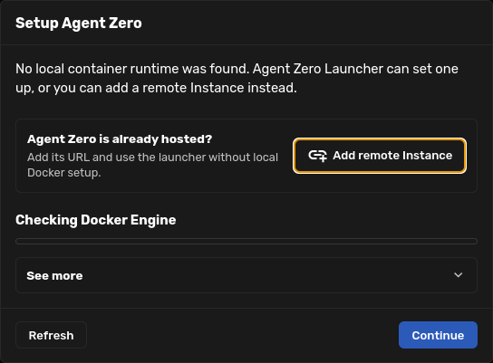
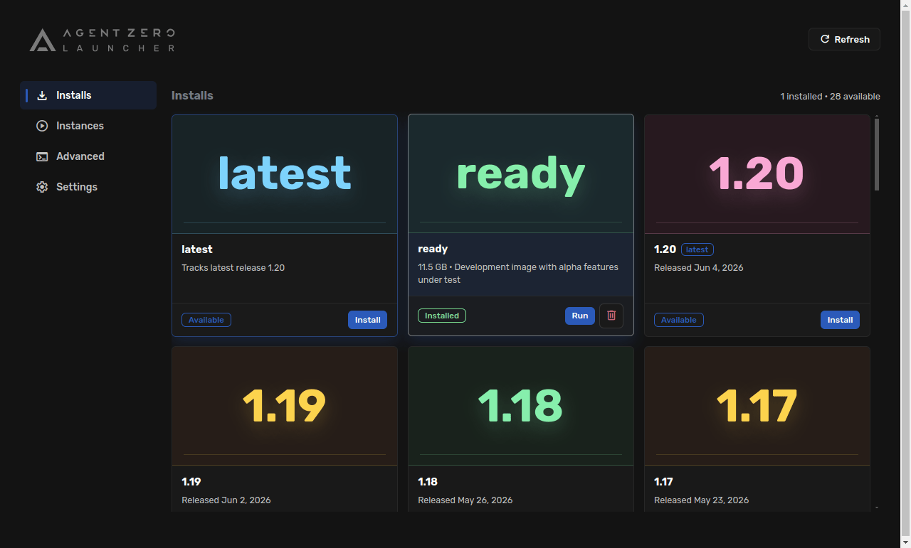

# Agent Zero Launcher

Agent Zero Launcher is the desktop app for installing, running, switching, and
opening Dockerized Agent Zero Instances without starting from Docker commands.

Use it when you are setting up a new machine, when you want a quiet inventory of
installed Agent Zero images, or when you want one place to open local and remote
Instances.

## Start Fresh On A New Machine

1. Download Agent Zero Launcher from the
   [A0 Launcher releases](https://github.com/agent0ai/a0-launcher/releases).
2. Open the app.
3. If the launcher cannot reach Docker yet, follow the setup dialog.
4. If Agent Zero is already hosted on another computer or VPS, click
   **Add remote Instance** instead of setting up local Docker.



The first setup dialog keeps the choice simple:

- **Continue** starts the local runtime setup or refreshes the runtime state.
- **Refresh** checks again after you start Docker yourself.
- **Add remote Instance** saves an existing Agent Zero URL and lets you use the
  Launcher without local Docker.

## Installs

When Docker is ready, Launcher opens to **Installs**. This page shows official
Agent Zero release lines and local images.



Cards usually mean:

- **latest** tracks the newest published Agent Zero release image.
- **ready** tracks the development-ready image when you intentionally work from
  that branch.
- Version cards such as **1.20**, **1.19**, or **1.18** are pinned release
  images.
- **Install** downloads an image.
- **Run** starts an installed image as a local Instance.

## Instances

Open **Instances** after you run Agent Zero. This is where local containers and
saved remote Instances live.

Use the Instance card to:

- open the Web UI;
- start, stop, rename, or delete the container;
- open logs;
- use **Backup `/a0/usr`** to download the same user-data backup you can create
  from Agent Zero Core;
- use **Restore `/a0/usr`** to restore that backup zip into the selected
  Instance;
- open A0 CLI when the host connector is installed.

Launcher keeps local Instances and remote Instances separate, so deleting a
container is not the same as deleting a saved remote URL or a workspace backup.

## Updating With Launcher

For same-major Agent Zero updates, the Web UI **Self Update** is still the
normal path.

For a major image jump such as v1.20 -> v2.0, use Launcher or Docker to start a
new v2.0 Instance, then restore a backup from the old Instance. In Launcher, the
flow is: **Instances -> Backup `/a0/usr`** on the old v1.20 Instance, **Installs
-> latest -> Install/Run**, then **Instances -> Restore `/a0/usr`** on the new
v2.0 Instance. This avoids mixing an old root install with a new Docker image.

See [Updating from v1.20 to v2.0](../setup/installation.md#updating-from-v120-to-v20).

## Capture Launcher Screenshots With Playwright

Launcher is an Electron app, so browser-only Playwright commands are not enough.
Use Playwright's Electron bridge and the local Electron binary from the Launcher
repo.

The pattern below installs Playwright into a temporary folder outside the repo,
launches local Launcher content, waits for the `a0app://content/` window, and
saves a screenshot.

```bash
mkdir -p /tmp/a0-launcher-playwright
npm install --prefix /tmp/a0-launcher-playwright playwright
```

```bash
NODE_PATH=/tmp/a0-launcher-playwright/node_modules node <<'JS'
const { _electron: electron } = require("playwright");

const launcher = "/home/eclypso/a0/a0-launcher";
const sleep = (ms) => new Promise((resolve) => setTimeout(resolve, ms));

(async () => {
  const app = await electron.launch({
    executablePath: `${launcher}/node_modules/electron/dist/electron`,
    args: [launcher],
    env: {
      ...process.env,
      A0_LAUNCHER_LOCAL_REPO: launcher,
      ELECTRON_DISABLE_SECURITY_WARNINGS: "true",
    },
  });

  const windows = [];
  app.on("window", (page) => windows.push(page));
  windows.push(await app.firstWindow());

  let page = null;
  const deadline = Date.now() + 45000;
  while (Date.now() < deadline && !page) {
    page = windows.find((item) =>
      item && !item.isClosed() && item.url().startsWith("a0app://content/")
    ) || null;
    if (!page) {
      await app.waitForEvent("window", { timeout: 1000 })
        .then((item) => windows.push(item))
        .catch(() => null);
      await sleep(250);
    }
  }

  if (!page) throw new Error("Launcher content window did not open");

  await page.waitForLoadState("networkidle", { timeout: 10000 }).catch(() => null);
  await sleep(3000);
  await page.screenshot({
    path: `${launcher}/output/playwright/launcher-installs.png`,
    fullPage: false,
  });
  await app.close();
})();
JS
```

For docs screenshots that show the first-run runtime gate without changing the
real machine state, open the real Launcher page and render the real runtime-gate
component with a minimal demo state:

```js
await page.evaluate(async () => {
  const { renderRuntimeGate } = await import(
    "a0app://content/components/docker-manager/runtime-gate/runtime-gate.js"
  );

  renderRuntimeGate({
    stateLoaded: true,
    dockerAvailable: false,
    runtime: {
      platform: "linux",
      state: "not_provisioned",
      action: "install",
      canProvision: true,
      setupActionLabel: "Setup Agent Zero",
      detail: "No local container runtime was found.",
    },
    versions: [{ id: "latest", availability: "available" }],
    images: [],
    containers: [],
    remoteInstances: [],
  }, {
    refresh() {},
    provisionRuntime() {},
    openDockerDownload() {},
    addRemoteInstance() {},
  });
});

await page.locator(".dm-runtime-gate").screenshot({
  path: "/home/eclypso/a0/a0-launcher/output/playwright/launcher-runtime-setup.png",
});
```
