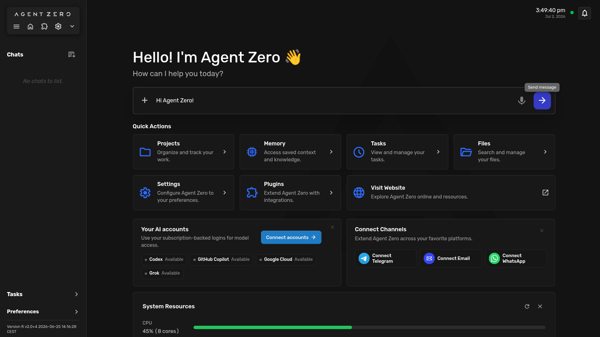
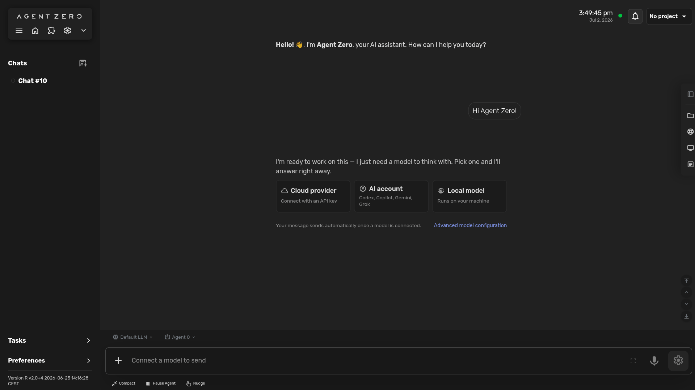
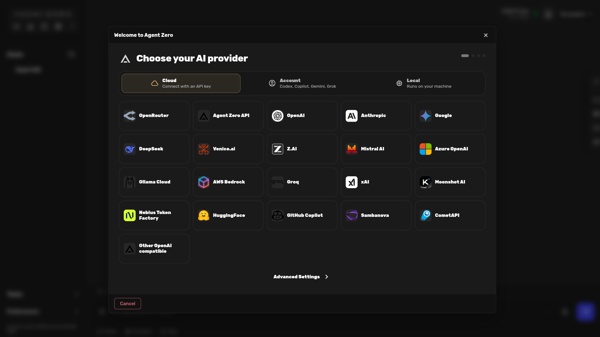
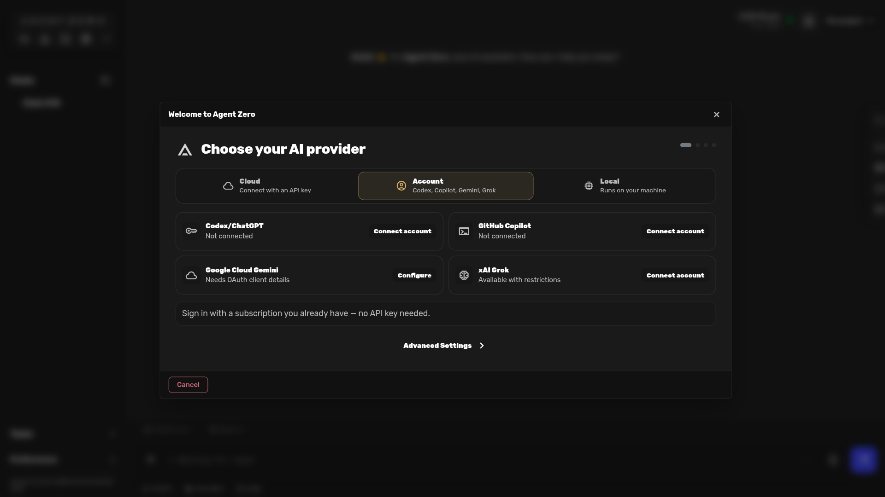
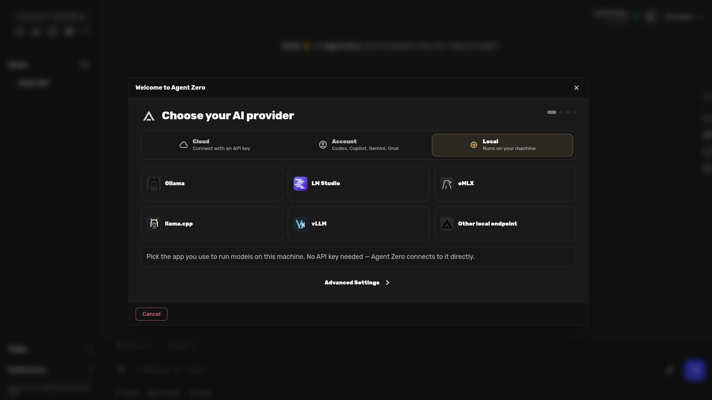
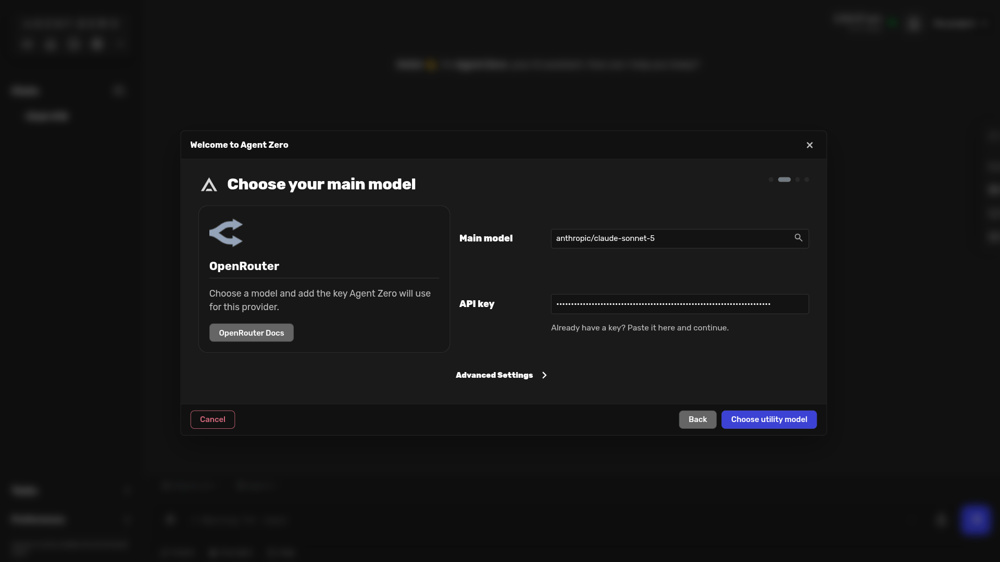
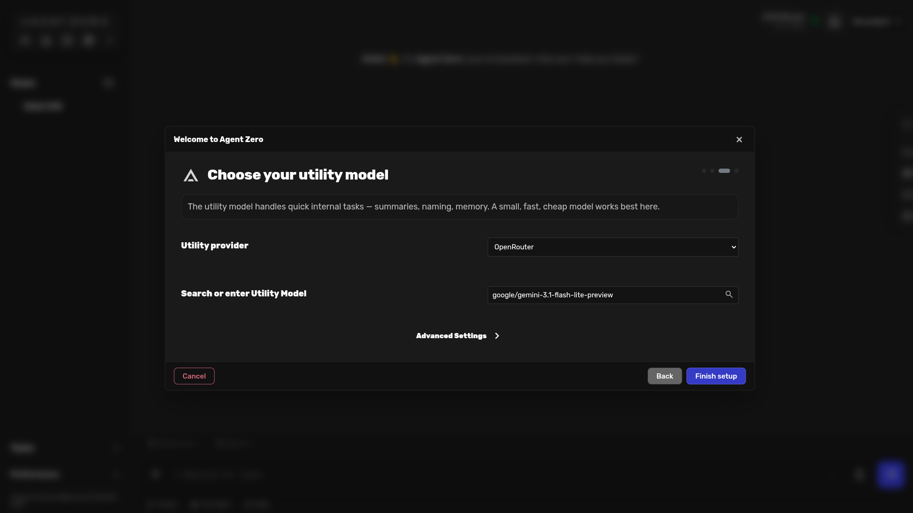
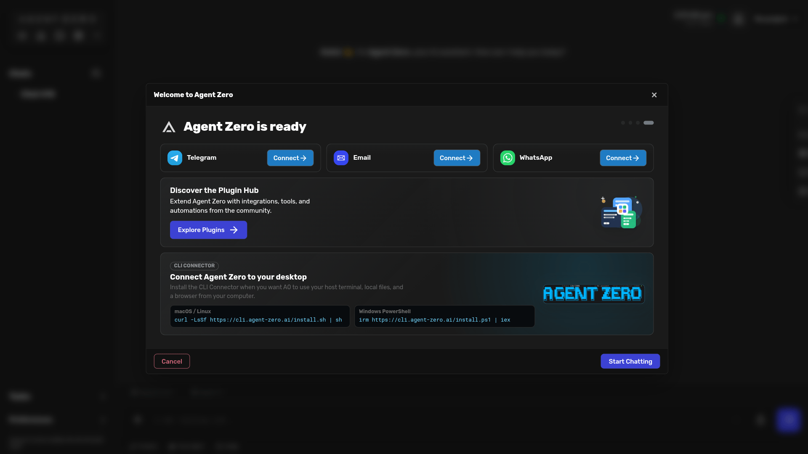

# First-Run Onboarding

Use onboarding the first time you open Agent Zero, or any time the Web UI says
your models still need setup. The wizard helps you pick Cloud, AI account, or
Local access, configure a main model, choose a utility model, and start
chatting.

This example uses **OpenRouter** with a masked demo key. Replace the demo key
with your own key.

## Open Onboarding

Open the Web UI. The welcome screen can show account shortcuts, and the message
composer is ready immediately.

If you send a message before models are configured, Agent Zero creates the chat,
holds the message, and shows the model gate inside the conversation. Choose
**Cloud provider**, **AI account**, or **Local model** to open onboarding.

## Choose A Provider Path

Choose **Cloud** when you want to paste an API key for OpenRouter, OpenAI,
Anthropic, Google, Venice, or another hosted provider.

Choose **Account** when you want to sign in with Codex/ChatGPT, GitHub Copilot,
Google Cloud Gemini, or xAI Grok instead of pasting a provider key.

Choose **Local** when you want to connect to Ollama, LM Studio, oMLX, llama.cpp,
vLLM, or another model server running on your machine.

## Configure The Main Model

For API-key providers, choose the main model and paste the provider key. The
screenshot uses a masked demo key.

After the main model is selected, click **Choose utility model**.

## Choose The Utility Model

The utility model handles quick internal tasks such as summaries, naming, and
memory. A small, fast, cheap model usually works best here. The wizard may
prefill a utility provider and model, but it remains an explicit choice.

Click **Finish setup** when the utility model looks right.

## Start Chatting

The ready screen confirms that model setup is done. Optional setup cards may
appear for integrations such as Telegram, Email, WhatsApp, or plugins.

Click **Start Chatting** to create a chat and begin using Agent Zero.

> [!IMPORTANT]
> Do not reuse the fake key shown in this guide. Paste your own provider key,
> and do not share screenshots that reveal real keys or private account details.
