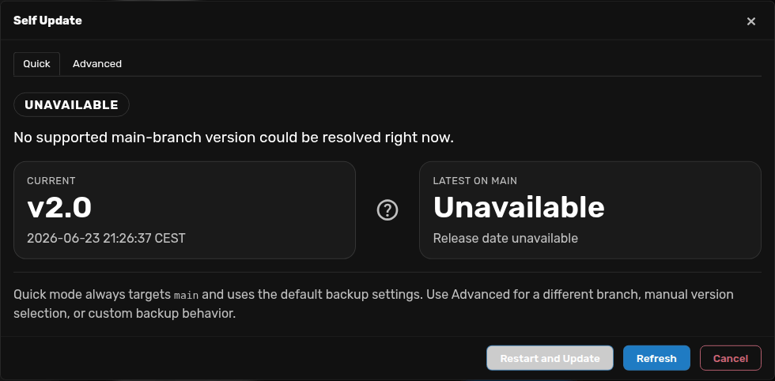

# Self Update

## Using Self Update in the Web UI

For day-to-day upgrades inside a running instance:

1. Open **Settings UI → Update** tab
2. Open **Self Update**
3. Wait for the update checker to see if you have the latest version or if there's an available update.

The UI will tell you when a new A0 update is available for download. Backups are automatically managed internally during the update process.

---

## Technical reference

Agent Zero includes a Docker-oriented self-update flow for switching to a specific repository version tag on `main`, `testing`, or `development`.

## How it works

1. The Web UI writes a YAML request file outside `/a0` so the request survives upgrades and downgrades.
2. Agent Zero restarts.
3. The durable updater in `/exe` reads the YAML request before starting the UI.
4. It cleans the root `uv` cache when `uv` is available.
5. If requested, it creates a zip backup of `/a0/usr`.
6. It fetches the requested branch and update target from the official Agent Zero repository.
7. It updates `/a0` while preserving gitignored paths such as `/a0/usr`.
8. It starts Agent Zero again and waits for `/api/health` to become healthy.
9. If the UI does not become healthy within the allowed time, it restores the previous checkout and starts that version again.

## Durable files

The self-update flow stores its runtime files outside `/a0`:

- Trigger file: `/exe/a0-self-update.yaml`
- Status file: `/exe/a0-self-update-status.yaml`
- Last attempt log: `/exe/a0-self-update.log`

Because these files live in `/exe`, you can recover from an older downgraded `/a0` by creating a new update YAML manually.

## Backup behavior

The updater automatically creates a backup of `a0/usr`.

## Version selection

The Web UI preloads repository version choices for the selected branch into a standard selector.

Only versions from the current major release line are listed in the selector. If newer major lines are available on the selected branch, the UI shows an attention banner that links to the Docker update guide.

The selector also includes `latest` when the selected branch is still on the current major line:

- On `main`, `latest` resolves to the newest reachable release tag on `main`. It is displayed as `latest (vX.Y)`.
- On `testing` and `development`, `latest` resolves to the current branch head. It is displayed as `latest (vX.Y+N)` when the branch head is `N` commits past the newest reachable tag, or `latest (vX.Y)` when it is exactly on a tag.

Agent Zero version tags follow this format:

`v{major}.{minor}`

Examples:

- `v1.0`
- `v1.1`

Tags below `v1.0` are ignored by the selector and rejected by the self-update request validator.

## Major version limitation

Self-update is intentionally limited to changes within the same major line.

If a newer major line exists, the UI points you to the Docker setup guide because those upgrades require downloading a new Docker image. They can include operating system level changes or other breaking changes outside the repository checkout.

## v1.20 to v2.0

Use the Docker image update path for v1.20 -> v2.0. Self Update can show that a
newer major release line exists, but it intentionally keeps the version selector
inside the current major line.

The important part is moving a backup zip into a fresh v2.0 container:

1. In the old v1.20 Web UI, create a backup from **Settings -> Check for Updates -> Backup & Restore -> Create Backup**.
2. Pull `agent0ai/agent-zero:latest` in Docker Desktop or Docker CLI. For the v2.0 release, `latest` is the v2.0 image.
3. Start a new container from that image, or use the **latest** card in **Agent Zero Launcher**.
4. Restore the downloaded backup zip into the new v2.0 Instance.
5. Verify the new Instance before deleting the old v1.20 container.

For command examples, see [Updating from v1.20 to v2.0](../setup/installation.md#updating-from-v120-to-v20).

## Safety notes

- Gitignored paths are preserved during update
- Obsolete tracked files are removed as part of the checkout replacement
- Rollback is automatic when the updated UI fails its health check
- The updater itself lives outside `/a0`, so it is not lost by downgrading to an older repository state
