# Installation Guide

## **Goal:** Go from zero to a first working chat with minimal setup.

---

## Quick Start (Recommended)

Agent Zero runs as a Docker container, and you now have two friendly ways to get
there:

- **A0 Launcher** is the desktop app. It can download Agent Zero, create and
  manage Instances, and help set up the local container runtime when needed.
- **A0 Install** is the terminal installer. It is best for SSH sessions,
  servers, scripted setup, recovery shells, or users who prefer commands.

If Docker is already installed and running, you can also start the container
directly.

### A0 Launcher

Use **A0 Launcher** when you want the guided desktop path. Download the app for
your platform, open it, and let it check Docker or set up a runtime before it
downloads Agent Zero.

#### Downloads

| Architecture | macOS | Linux | Windows |
| --- | --- | --- | --- |
| x86 | [Mac Intel](https://github.com/agent0ai/a0-launcher/releases/download/v0.9/a0-launcher-0.9-macos-x64.dmg) | [Linux x86](https://github.com/agent0ai/a0-launcher/releases/download/v0.9/a0-launcher-0.9-linux-x64.AppImage) | [Windows x86](https://github.com/agent0ai/a0-launcher/releases/download/v0.9/a0-launcher-0.9-windows-x64.exe) |
| ARM64 | [Mac Apple Silicon](https://github.com/agent0ai/a0-launcher/releases/download/v0.9/a0-launcher-0.9-macos-arm64.dmg) | [Linux ARM64](https://github.com/agent0ai/a0-launcher/releases/download/v0.9/a0-launcher-0.9-linux-arm64.AppImage) | [Windows ARM64](https://github.com/agent0ai/a0-launcher/releases/download/v0.9/a0-launcher-0.9-windows-arm64.exe) |

See the [A0 Launcher v0.9 release](https://github.com/agent0ai/a0-launcher/releases/tag/v0.9)
for release notes and updater metadata. See the
[Launcher guide](../guides/launcher.md) for the first-run walkthrough.

### A0 Install

Use **A0 Install** when you want the command-line path. The installer creates a
Dockerized Agent Zero instance, mounts user data to `/a0/usr`, and tries to
reuse an existing Docker-compatible runtime before setting one up.

#### macOS / Linux
```bash
curl -fsSL https://bash.agent-zero.ai | bash
```

#### Windows PowerShell
```powershell
irm https://ps.agent-zero.ai | iex
```

#### Headless / scripted

For servers and automation, Quick Start mode creates one instance and exits
without opening menus:

```bash
curl -fsSL https://bash.agent-zero.ai | bash -s -- --quick-start --name agent-zero --port 5080
```

```powershell
& ([scriptblock]::Create((irm https://ps.agent-zero.ai))) -QuickStart -Name agent-zero -Port 5080
```

Use `--skip-runtime-setup` / `-SkipRuntimeSetup` when Docker must already be
working and the installer should not try to set up a runtime. See the
[A0 Install repository](https://github.com/agent0ai/a0-install) for all
installer flags.

### Docker already installed? Run this directly

```bash
docker run -p 80:80 -v a0_usr:/a0/usr agent0ai/agent-zero
```

Once the install completes, open the URL shown in your terminal or Launcher to
access the Web UI. Complete onboarding, add your model provider or API key, then
continue to [Step 3: Configure Agent Zero](#step-3-configure-agent-zero).

> [!TIP]
> Need Agent Zero to reach host-machine files, shell, or a host browser? Install the optional [A0 CLI Connector](../guides/a0-cli-connector.md), then run `a0` to connect your terminal to this Agent Zero instance.

---

## How to Update Agent Zero

### Self Update (Recommended)

Use the built-in updater in the Web UI:

1. Open **Settings UI -> Update** tab
2. Open **Self Update**
3. Wait for the update checker to see if you have the latest version or if there's an available update. 

You'll also be prompted through the UI when a new A0 version is released. Backups are automatically managed internally during this process.

For technical details of the updater, see [Self Update](../guides/self-update.md).

### Updating from v1.20 to v2.0

Agent Zero v2.0 starts a new major release line. If your instance is on v1.20,
the in-app Self Update can show the newer v2.x line, but it will not apply that
jump inside the existing v1 Docker image. The safe path is:

1. Create a backup zip from the old v1.20 instance.
2. Pull the new `agent0ai/agent-zero:latest` Docker image. For the v2.0 release,
   `latest` is the v2.0 image.
3. Start a new container from that image.
4. Restore the backup zip into the new v2.0 instance.

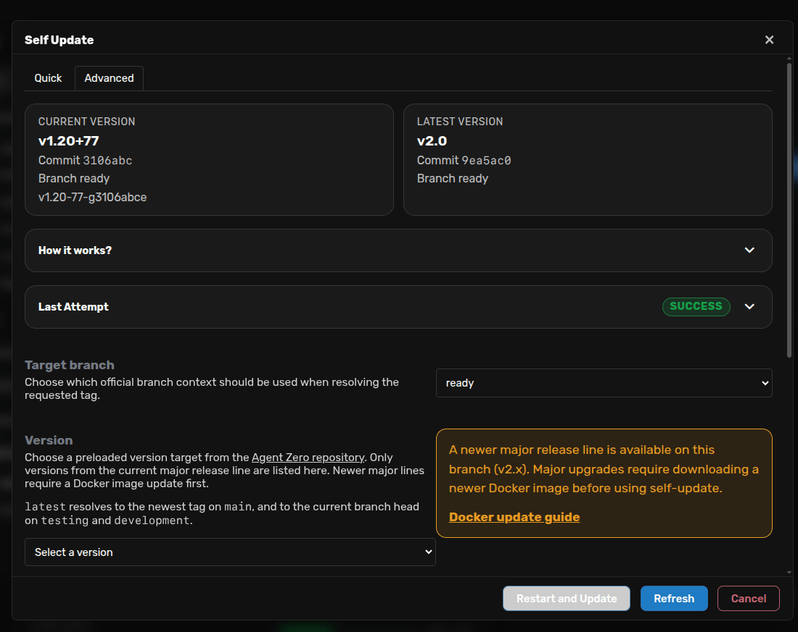

#### Without Agent Zero Launcher

Use this path if you manage Agent Zero directly from Docker Desktop or Docker
CLI.

1. Open your old v1.20 Web UI and create a backup from **Settings -> Check for Updates -> Backup & Restore -> Create Backup**. Keep the downloaded `.zip` file.
2. Pull the v2.0 image. In **Docker Desktop**, search for `agent0ai/agent-zero:latest` and pull that image. In **Docker CLI**, run:
   ```bash
   docker pull agent0ai/agent-zero:latest
   ```
3. Start a new v2.0 container on a different host port so the old instance stays available:
   ```bash
   docker run -d -p 50081:80 --name agent-zero-v2 -v a0_v2_usr:/a0/usr agent0ai/agent-zero:latest
   ```
4. Open the new v2.0 instance, complete any first-run prompts, then restore the downloaded `.zip` from **Settings -> Check for Updates -> Backup & Restore -> Restore Backup**.
5. Verify chats, projects, memory, settings, and custom plugins before removing the old v1.20 container.

#### With Agent Zero Launcher

Launcher gives you the same backup/restore idea from the **Instances** page.

1. Open **Instances**, choose the old v1.20 Instance, and use **Backup `/a0/usr`**.
2. Open **Installs**, use the **latest** card, then **Install** or **Run** the image. For the v2.0 release, **latest** is the v2.0 image.
3. Return to **Instances**, choose the new v2.0 Instance, and use **Restore `/a0/usr`** with the backup zip.
4. Open the new Instance and verify it before deleting or stopping the old v1.20 container.

Launcher keeps old and new Instances visible separately, which makes it easier
to compare them before cleanup.

> [!CAUTION]
> Do not try to solve the v1.20 -> v2.0 jump by bind-mounting the whole old
> `/a0` directory into a new container. Keep user data under `/a0/usr`, use the
> backup/restore flow, and let the new image provide the v2.0 system files.

### Updating from Pre-v0.9.8

If you are upgrading from Agent Zero v0.9.8 or earlier to v1.1 or newer, use the migration path below. Older installs were laid out differently, so the in-app Self Update is not the right tool for that jump.

1. **Backup your existing `usr/` directory** (which contains your settings, projects, memory, and custom plugins).
2. **Run the new install script** to set up the current Docker-based install:
   - macOS / Linux: `curl -fsSL https://bash.agent-zero.ai | bash`
   - Windows (PowerShell): `irm https://ps.agent-zero.ai | iex`
3. **Migrate your data:** After the new installation completes, copy the contents of your backed-up `usr/` directory into the new `/a0/usr/` directory created by the script.
4. Restart the container for the changes to take effect.

### Manual Update (Advanced)

> Use this only if Self Update is unavailable or you must manage containers yourself (for example, some custom Docker setups).

1. Keep the current container running
2. `docker pull agent0ai/agent-zero:latest`
3. Start a **new** container on a different host port, for example: `docker run -d -p 50081:80 --name agent-zero-new agent0ai/agent-zero:latest`
4. On the **old** instance: **Settings -> Check for Updates -> Backup & Restore -> Create Backup**
5. On the **new** instance: restore the downloaded backup zip
6. Verify chats and data, then remove the old container

> [!CAUTION]
> Do not delete the old container until the new one has your data.

> [!TIP]
> If the new instance fails to load settings, remove `/a0/usr/settings.json` and restart to regenerate default settings.

---

## Manual Installation (Advanced)

> Users should use [Quick Start (Recommended)](#quick-start-recommended) above. The steps below are for custom Docker setups, air-gapped installs, or when you cannot use the install scripts.

Follow the steps below to install Docker and run the image by hand.

### Step 1: Install Docker Desktop

Docker Desktop provides the runtime environment for Agent Zero, ensuring consistent behavior and security across platforms. The entire framework runs within a Docker container, providing isolation and easy deployment.

**Choose your operating system:**

<table>
<tr>
<td align="center" width="33%">
<a href="#windows-installation">
<br/>
<b>Windows</b>
</a>
</td>
<td align="center" width="33%">
<a href="#macos-installation">
<br/>
<b>macOS</b>
</a>
</td>
<td align="center" width="33%">
<a href="#linux-installation">
<br/>
<b>Linux</b>
</a>
</td>
</tr>
</table>

---

<a name="windows-installation"></a>
####  Windows Installation

**1.1. Download Docker Desktop**

Go to the [Docker Desktop download page](https://www.docker.com/products/docker-desktop/) and download the Windows version (Intel/AMD is the main download button).

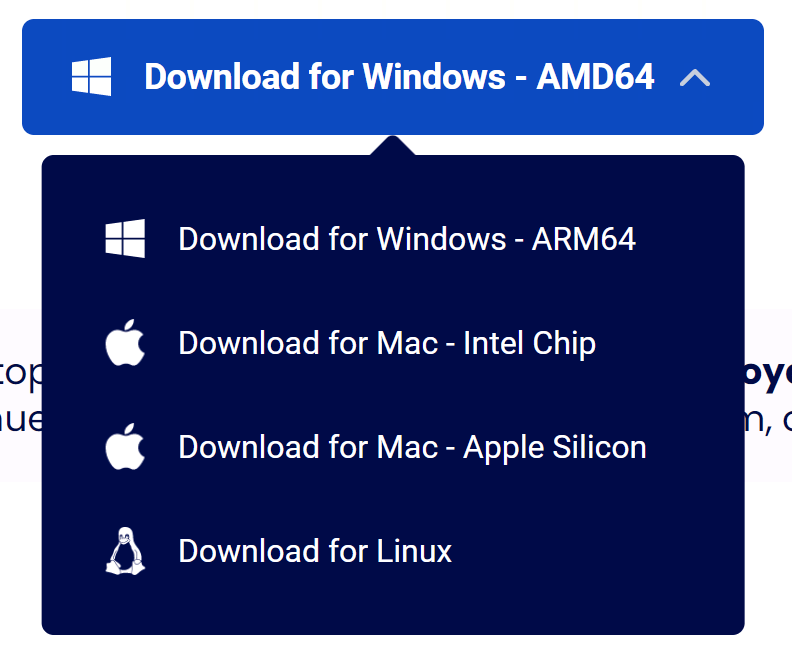
<br><br>

**1.2. Run the Installer**

Run the installer with default settings.

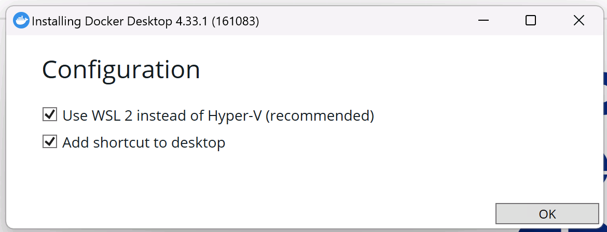
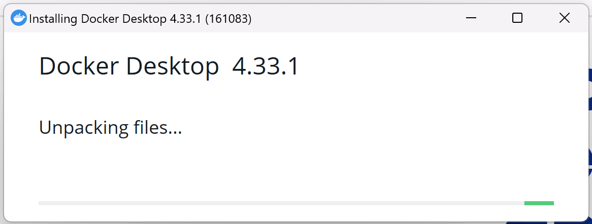
<br><br>

**1.3. Launch Docker Desktop**

Once installed, launch Docker Desktop from your Start menu or desktop shortcut.

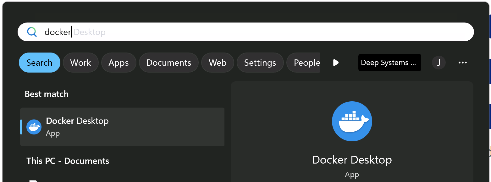

**Docker is now installed.**

Continue to [Step 2: Run Agent Zero](#step-2-run-agent-zero)

---

<a name="macos-installation"></a>
####  macOS Installation

**1.1. Download Docker Desktop**

Go to the [Docker Desktop download page](https://www.docker.com/products/docker-desktop/) and download the macOS version (choose Apple Silicon or Intel based on your Mac).


<br><br>

**1.2. Install Docker Desktop**

Drag and drop the Docker application to your Applications folder.

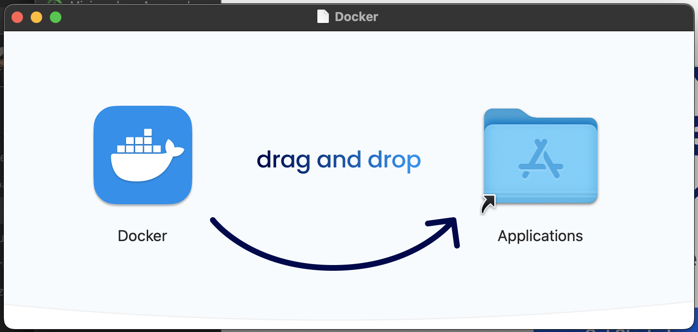
<br><br>

**1.3. Launch Docker Desktop**

Open Docker Desktop from your Applications folder.

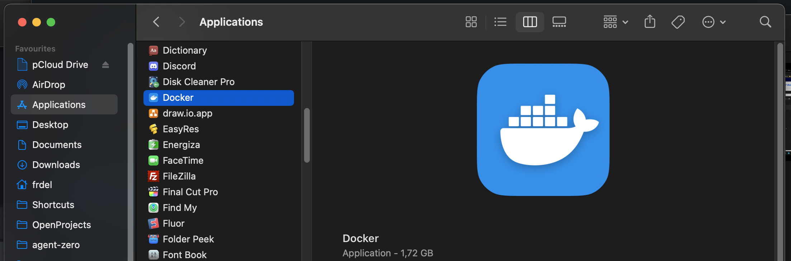
<br><br>

**1.4. Configure Docker Socket**

> [!NOTE]
> **Important macOS Configuration:** In Docker Desktop's preferences (Docker menu) -> Settings -> Advanced, enable "Allow the default Docker socket to be used (requires password)."

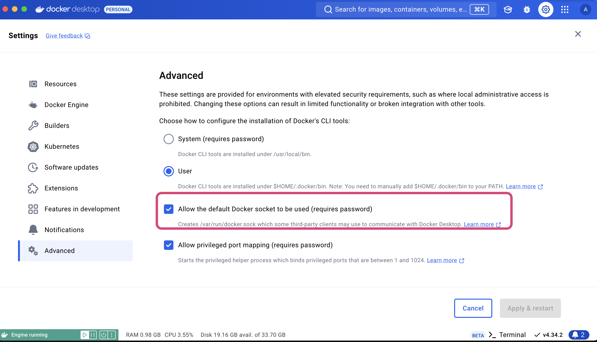

**Docker is now installed.**

Continue to [Step 2: Run Agent Zero](#step-2-run-agent-zero)

---

<a name="linux-installation"></a>
####  Linux Installation

**1.1. Choose Installation Method**

You can install either Docker Desktop or docker-ce (Community Edition).

**Option A: Docker Desktop (Recommended for beginners)**

Follow the instructions for your specific Linux distribution [here](https://docs.docker.com/desktop/install/linux-install/).

**Option B: docker-ce (Lightweight alternative)**

Follow the installation instructions [here](https://docs.docker.com/engine/install/).

**1.2. Post-Installation Steps (docker-ce only)**

If you installed docker-ce, add your user to the `docker` group:

```bash
sudo usermod -aG docker $USER
```

Log out and back in, then authenticate:

```bash
docker login
```

**1.3. Launch Docker**

If you installed Docker Desktop, launch it from your applications menu.

**Docker is now installed.**

> [!TIP]
> **Deploying on a VPS/Server?** For production deployments with reverse proxy, SSL, and domain configuration, see the [VPS Deployment Guide](vps-deployment.md).

---

### Step 2: Run Agent Zero

#### 2.1. Pull the Agent Zero Docker Image

**Using Docker Desktop GUI:**

- Search for `agent0ai/agent-zero` in Docker Desktop
- Click the `Pull` button
- The image will be downloaded to your machine in a few minutes

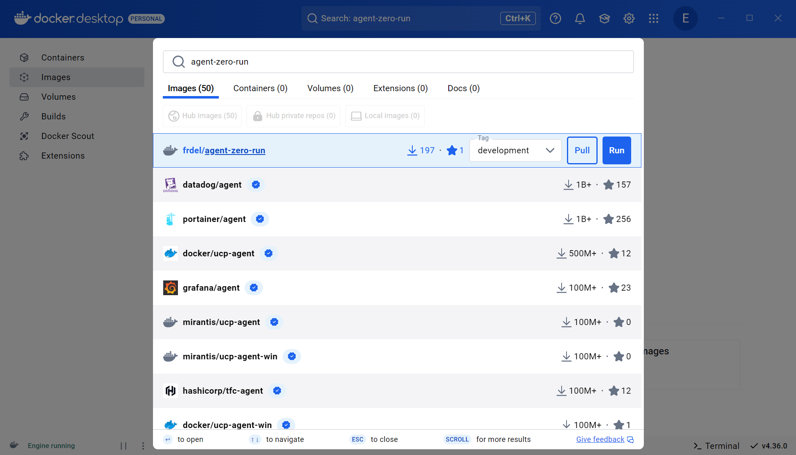

**Using Terminal:**

```bash
docker pull agent0ai/agent-zero
```

#### 2.2. (Optional) Map Folders for Persistence

Choose or create a folder on your computer where Agent Zero will save its data. 

Setting up persistence is needed only if you want your data and files to remain available even after you delete the container.

You can pick any location you find convenient:

- **Windows:** `C:\agent-zero-data`
- **macOS/Linux:** `/home/user/agent-zero-data`

You can map just the `/a0/usr` directory (recommended) or individual subfolders of `/a0` to a local directory.

> [!CAUTION]
> Do **not** map the entire `/a0` directory: it contains the application code and can break upgrades.

> [!TIP]
> Choose a location that's easy to access and backup. All your Agent Zero data will be directly accessible in this directory.

#### 2.3. Run the Container

**Using Docker Desktop GUI:**

- In Docker Desktop, go to the "Images" tab
- Click the `Run` button next to the `agent0ai/agent-zero` image
- Open the "Optional settings" menu
- **Ensure at least one host port is mapped to container port `80`** (set host port to `0` for automatic assignment)
- Click the `Run` button

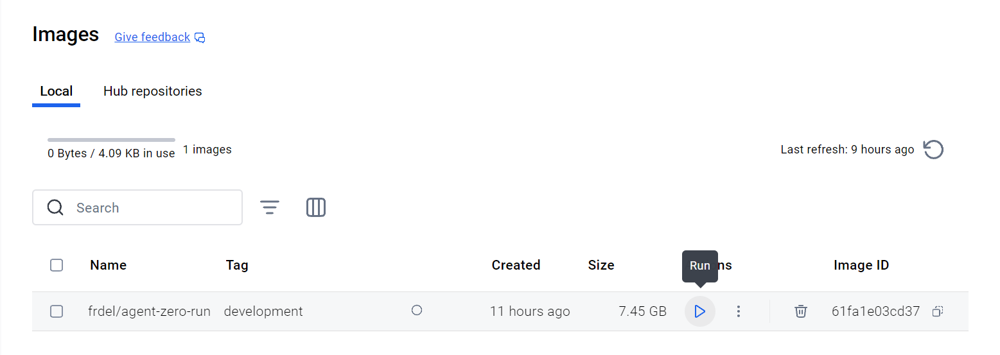


The container will start and show in the "Containers" tab:

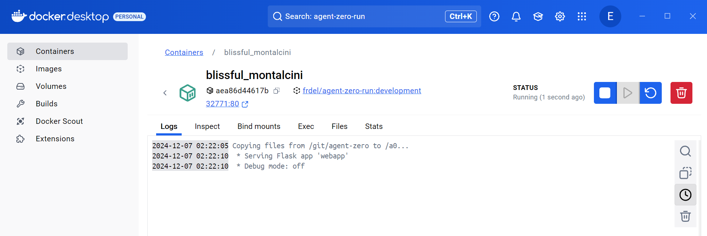

#### 2.4. Access the Web UI

The framework will take a few seconds to initialize. Find the mapped port in Docker Desktop (shown as `<PORT>:80`) or click the port right under the container ID:

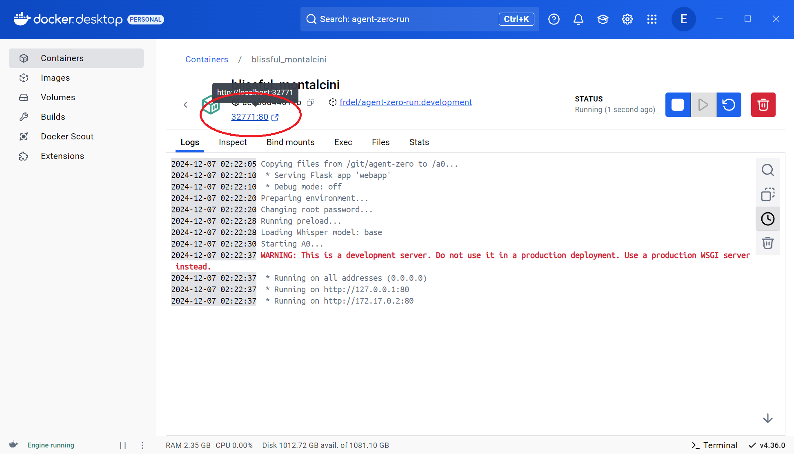

Open `http://localhost:<PORT>` in your browser. The Web UI will open - Agent Zero is ready for configuration!


> [!TIP]
> You can also access the Web UI by clicking the port link directly under the container ID in Docker Desktop.

> [!NOTE]
> After starting the container, you'll find all Agent Zero files in your chosen directory. You can access and edit these files directly on your machine, and the changes will be immediately reflected in the running container.

**Running A0 using Terminal?**

```bash
docker run -p 0:80 -v /path/to/your/work_dir:/a0/usr agent0ai/agent-zero
```

- Replace `0` with a fixed port if you prefer (e.g., `50080:80`)

---

## Step 3: Configure Agent Zero

The UI will show a welcome banner when model setup is missing. Click
**Start Onboarding** to choose Cloud or Local, add a provider key or account
connection, and select your main and utility models. For the screenshot
walkthrough, see the [First-Run Onboarding guide](../guides/onboarding.md).

### Settings Configuration

Agent Zero provides a comprehensive settings interface to customize various aspects of its functionality. Access the settings by clicking the "Settings" button with a gear icon in the sidebar.

### Agent Configuration

- **Agent Profile:** Select the default profile for new chats, such as `agent0`,
  `hacker`, or `researcher`.
- **Memory Subdirectory:** Select the subdirectory for agent memory storage, allowing separation between different instances.
- **Knowledge Subdirectory:** Specify the location of custom knowledge files to enhance the agent's understanding.

See the [Agent Profiles guide](../guides/agent-profiles.md) for the chat menu,
profile switching, and guided profile creation.

> [!NOTE]
> Since v0.9.7, custom prompts belong inside a specific agent profile rather
> than a shared `/prompts` folder. Most users should create profiles from the
> chat profile menu.

> [!NOTE]
> The Hacker profile is included in the main image. After launch, choose the **hacker** agent profile in Settings to make it the default for new chats, or switch the selected chat from the composer profile selector. The "hacker" branch is deprecated.

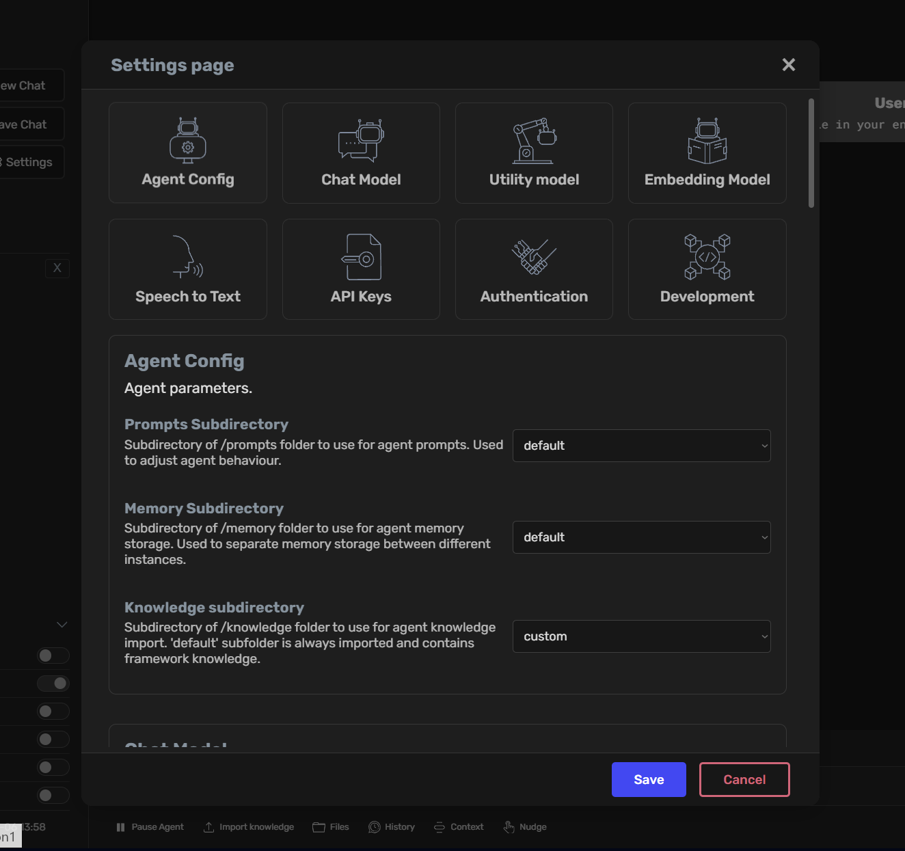

### Chat Model Settings

- **Provider:** Select the chat model provider (e.g., Anthropic)
- **Model Name:** Choose the specific model (e.g., claude-sonnet-4-5)
- **Context Length:** Set the maximum token limit for context window
- **Context Window Space:** Configure how much of the context window is dedicated to chat history

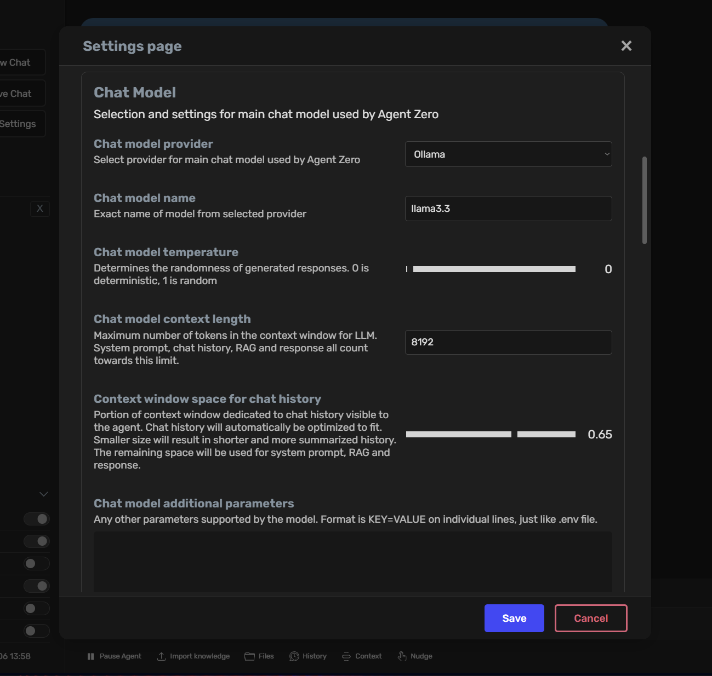

**Model naming is provider-specific.**

Use `claude-sonnet-4-5` for Anthropic, but use `anthropic/claude-sonnet-4-5` for OpenRouter. If you see "Invalid model ID," verify the provider and naming format on the provider website, or search the web for "<name-of-ai-model> model naming".

> [!TIP]
> **Context window tuning:** Set the total context window size first (for example, 100k), then adjust the chat history portion as a fraction of that total. A large fraction on a very large context window can still be enormous.

> [!TIP]
> **API URL:** URL of the API endpoint for the chat model - only needed for some providers like Ollama, LM Studio, Azure, etc.

### Utility Model Configuration

- **Provider & Model:** Select a model for utility tasks like memory organization and summarization
- **Temperature:** Adjust the determinism of utility responses

> [!NOTE]
> Utility models need to be strong enough to extract and consolidate memory reliably. Very small models (e.g., 4B) often fail at this; 70B-class models or high-quality cloud "flash/mini" models work best.

### Embedding Model Settings [Optional]

- **Provider:** Choose the embedding model provider (e.g., OpenAI)
- **Model Name:** Select the specific embedding model (e.g., text-embedding-3-small)

> [!NOTE]
> Agent Zero uses a local embedding model by default (runs on CPU), but you can switch to OpenAI embeddings like `text-embedding-3-small` or `text-embedding-3-large` if preferred.

### Built-in Voice Plugins

- Agent Zero ships Whisper STT as the built-in `_whisper_stt` plugin and Kokoro TTS as the built-in `_kokoro_tts` plugin.
- Docker/bootstrap remains responsible for installing the required speech dependencies such as `ffmpeg`, Kokoro, Whisper, and `soundfile`.
- Both plugins can be enabled or disabled independently from the Agent Plugins section in the Web UI.
- Whisper model size, language, message handling, and silence behavior are configured from the plugin settings screen.
- If `_kokoro_tts` is disabled, spoken output falls back to the browser's native speech synthesis instead of the container runtime.

### API Keys

Configure API keys for various service providers directly within the Web UI. Click `Save` to confirm your settings.

> [!NOTE]
> **OpenAI API vs Plus subscription:** A ChatGPT Plus subscription does not include API credits. You must provide a separate API key for OpenAI usage in Agent Zero.

> [!TIP]
> For OpenAI-compatible providers (e.g., custom gateways or Z.AI/GLM), add the API key under **External Services -> Other OpenAI-compatible API keys**, then select **OpenAI Compatible** as the provider in model settings.

> [!CAUTION]
> **GitHub Copilot Provider:** When using the GitHub Copilot provider, after selecting the model and entering your first prompt, the OAuth login procedure will begin. You'll find the authentication code and link in the output logs. Complete the authentication process by following the provided link and entering the code, then you may continue using Agent Zero.

### Authentication

- **UI Login:** Set username for web interface access
- **UI Password:** Configure password for web interface security
- **Root Password:** Manage Docker container root password for SSH access

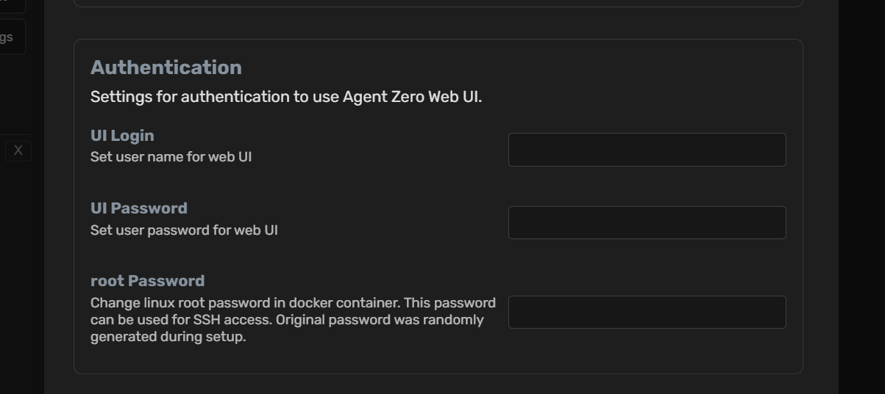

### Development Settings

- **RFC Parameters (local instances only):** Configure URLs and ports for remote function calls between instances
- **RFC Password:** Configure password for remote function calls

Learn more about Remote Function Calls in the [Development Setup guide](dev-setup.md#step-6-configure-ssh-and-rfc-connection).

> [!IMPORTANT]
> Always keep your API keys and passwords secure.

> [!NOTE]
> On Windows host installs (non-Docker), you must use RFC to run shell code on the host system. The Docker runtime handles this automatically.

---

## Choosing Your LLMs

The Settings page is the control center for selecting the Large Language Models (LLMs) that power Agent Zero. You can choose different LLMs for different roles:

| LLM Role | Description |
| --- | --- |
| `chat_llm` | This is the primary LLM used for conversations, agent reasoning, and tool use. Vision support controls image understanding. |
| `utility_llm` | This LLM handles internal tasks like summarizing messages, managing memory, and processing internal prompts. Using a smaller, less expensive model here can improve efficiency. |
| `embedding_llm` | The embedding model shipped with A0 runs on CPU and is responsible for generating embeddings used for memory retrieval and knowledge base lookups. Changing the `embedding_llm` will re-index all of A0's memory. |

**How to Change:**

1. Open Settings page in the Web UI.
2. Choose the provider for the LLM for each role (Main Model, Utility Model, Embedding Model) and write the model name.
3. Click "Save" to apply the changes.

> [!NOTE]
> The built-in Browser does not have a separate default model slot. The main agent decides when to call the direct `browser` tool. Browser settings can optionally choose a Browser LLM preset for Browser-owned helper operations.

### Important Considerations

#### Model Naming by Provider

Use the naming format required by your selected provider:

| Provider | Model Name Format | Example |
| --- | --- | --- |
| OpenAI | Model name only | `claude-sonnet-4-5` |
| OpenRouter | Provider prefix mostly required | `anthropic/claude-sonnet-4-5` |
| Ollama | Model name only | `gpt-oss:20b` |
| oMLX | API-visible model name from `/v1/models` | `Qwen3-0.6B-4bit` |
| llama.cpp | API-visible model name from `/v1/models` or `--alias` | `local-gguf` |
| vLLM | Hugging Face model ID or served model alias | `Qwen/Qwen2.5-1.5B-Instruct` |

> [!TIP]
> If you see "Invalid model ID," verify the provider and naming format on the provider website, or search the web for "<name-of-ai-model> model naming".

#### Context Window & Memory Split

- Set the **total context window** (e.g., 100k) first.
- Then tune the **chat history portion** as a fraction of that total.
- Extremely large totals can make even small fractions very large; adjust thoughtfully.

#### Utility Model Guidance

- Utility models handle summarization and memory extraction.
- Very small models (about 4B) usually fail at reliable context extraction.
- Aim for ~70B class models or strong cloud "flash/mini" models for better results.

#### Reasoning/Thinking Models

- Reasoning can increase cost and latency. Some models perform better **without** reasoning.
- If a model supports it, disable reasoning via provider-specific parameters (e.g., Venice `disable_thinking=true`).

---

## Installing and Using oMLX (Apple Silicon Local Models)

oMLX is a local inference server for Apple Silicon Macs. It serves MLX models through an OpenAI-compatible API and supports chat, embeddings, and model listing endpoints.

> [!NOTE]
> oMLX requires Apple Silicon and macOS 15+. On 16 GB machines, start with small quantized MLX models.

### macOS oMLX Installation

**Using Homebrew:**

```bash
brew tap jundot/omlx https://github.com/jundot/omlx
brew install omlx
omlx start
```

**Using the macOS App:**

Download the oMLX app from the [official website](https://omlx.ai/) and follow the welcome flow to choose a model directory, start the server, and download or discover models.

By default, oMLX serves its OpenAI-compatible API at `http://localhost:8000/v1`.

To run a foreground server with oMLX's paged SSD cache enabled:

```bash
omlx serve --model-dir ~/.omlx/models --paged-ssd-cache-dir ~/.omlx/cache
```

### Configuring oMLX in Agent Zero

1. Start oMLX and make sure at least one model is available in the oMLX dashboard or model directory.
2. In Agent Zero Settings, choose **oMLX** as the Chat model, Utility model, or Embedding model provider.
3. Use the model name shown by oMLX's model list or dashboard.
4. Agent Zero includes Docker-friendly defaults for oMLX on the host at `http://host.docker.internal:8000/v1`. Override the API base URL only if your oMLX server runs somewhere else.
5. Click `Save` to confirm your settings.

> [!NOTE]
> If Agent Zero runs in Docker and oMLX runs on the Mac host, ensure port **8000** is reachable from the container. The shipped Docker Compose file maps `host.docker.internal` to the host gateway for Linux Docker. Docker Desktop for macOS provides this hostname automatically.

---

## Installing and Using llama.cpp (GGUF Local Models)

llama.cpp provides `llama-server`, a lightweight OpenAI-compatible HTTP server for GGUF models. Agent Zero talks to it through the same `/v1` API used by OpenAI-compatible clients.

### macOS llama.cpp Installation

**Using Homebrew:**

```bash
brew install llama.cpp
```

Start a server with a downloaded GGUF model:

```bash
llama-server -m ~/models/model.gguf --port 8080 --alias local-gguf
```

By default, Agent Zero expects llama.cpp at `http://host.docker.internal:8080/v1`. The model name can be the model path returned by `/v1/models`, but using `--alias` gives you a short stable name such as `local-gguf`.

### Configuring llama.cpp in Agent Zero

1. Start `llama-server` and confirm `http://localhost:8080/v1/models` returns your model.
2. In Agent Zero Settings, choose **llama.cpp** as the Chat model, Utility model, or Embedding model provider.
3. Use the model ID shown by `/v1/models`, or the alias you passed with `--alias`.
4. Override the API base URL only if you started `llama-server` on another host or port.
5. Click `Save` to confirm your settings.

> [!NOTE]
> If Agent Zero runs in Docker and cannot reach a host-side `llama-server`, start the server on an address Docker can reach, for example `--host 0.0.0.0`, and keep the port firewalled to trusted clients.

---

## Installing and Using vLLM (Local OpenAI-Compatible Serving)

vLLM is a high-throughput local inference server with an OpenAI-compatible API. It is most common on Linux GPU hosts, and can also run on Apple Silicon through the vLLM Apple Silicon path or vLLM-Metal.

For Apple Silicon Macs, install and activate vLLM-Metal:

```bash
curl -fsSL https://raw.githubusercontent.com/vllm-project/vllm-metal/main/install.sh | bash
source ~/.venv-vllm-metal/bin/activate
```

Start a basic OpenAI-compatible server:

```bash
vllm serve Qwen/Qwen2.5-1.5B-Instruct --host 0.0.0.0 --port 8000
```

By default, Agent Zero expects vLLM at `http://host.docker.internal:8000/v1`, matching vLLM's default HTTP port. If another local provider already uses port 8000, start vLLM on another port and update Agent Zero's API base, for example `http://host.docker.internal:8001/v1`.

### Configuring vLLM in Agent Zero

1. Start vLLM and confirm `http://localhost:8000/v1/models` returns the served model.
2. In Agent Zero Settings, choose **vLLM** as the Chat model, Utility model, or Embedding model provider.
3. Use the model ID returned by vLLM's model list endpoint.
4. If you started vLLM with `--api-key`, enter the same key in the advanced provider settings or environment.
5. Click `Save` to confirm your settings.

> [!NOTE]
> vLLM serves one model at a time by default. Use a generation model for Chat and Utility slots, and a separate embedding-capable vLLM server if you want vLLM embeddings.

---

## Installing and Using Ollama (Local Models)

Ollama is a powerful tool that allows you to run various large language models locally.

---

<a name="windows-ollama-installation"></a>
###  Windows Ollama Installation

Download and install Ollama from the official website:

<button>[Download Ollama Setup](https://ollama.com/download/OllamaSetup.exe)</button>

Once installed, continue to [Pulling Models](#pulling-models).

---

<a name="macos-ollama-installation"></a>
###  macOS Ollama Installation

**Using Homebrew:**

```bash
brew install ollama
```

**Using Installer:**

Download from the [official website](https://ollama.com/).

Once installed, continue to [Pulling Models](#pulling-models).

---

<a name="linux-ollama-installation"></a>
###  Linux Ollama Installation

Run the installation script:

```bash
curl -fsSL https://ollama.com/install.sh | sh
```

Once installed, continue to [Pulling Models](#pulling-models).

---

### Pulling Models

**Finding Model Names:**

Visit the [Ollama model library](https://ollama.com/library) for a list of available models and their corresponding names. Ollama models are referenced by **model name only** (for example, `llama3.2`).

**Pull a model:**

```bash
ollama pull <model-name>
```

Replace `<model-name>` with the name of the model you want to use. For example: `ollama pull mistral-large`

### Configuring Ollama in Agent Zero

1. Once you've downloaded your model(s), select it in the Settings page of the GUI.
2. Within the Chat model, Utility model, or Embedding model section, choose **Ollama** as provider.
3. Write your model code as expected by Ollama, in the format `llama3.2` or `qwen2.5:7b`
4. Agent Zero includes Docker-friendly defaults for Ollama on the host at `http://host.docker.internal:11434`. Override the API base URL only if your Ollama server runs somewhere else.
5. Click `Save` to confirm your settings.

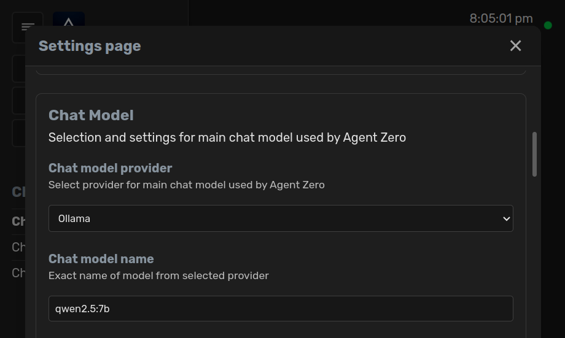

> [!NOTE]
> If Agent Zero runs in Docker and Ollama runs on the host, ensure port **11434** is reachable from the container. The shipped Docker Compose file maps `host.docker.internal` to the host gateway for Linux Docker. If both services are in the same Docker network, you can use `http://<container_name>:11434` instead of `host.docker.internal`.

### Managing Downloaded Models

**Listing downloaded models:**

```bash
ollama list
```

**Removing a model:**

```bash
ollama rm <model-name>
```

> [!TIP]
> Experiment with different model combinations to find the balance of performance and cost that best suits your needs. E.g., faster and lower latency LLMs will help, and you can also use `faiss_gpu` instead of `faiss_cpu` for the memory. 

---

## Using Agent Zero on Your Mobile Device

Agent Zero can be accessed from mobile devices and other computers using the built-in **Tunnel feature**.

### Recommended: Using Tunnel (Remote Access)

The Tunnel feature allows secure access to your Agent Zero instance from anywhere:

1. Open Settings in the Web UI
2. Navigate to the **External Services** tab
3. Click on **Flare Tunnel** in the navigation menu
4. Click **Create Tunnel** to generate a secure HTTPS URL
5. Share this URL to access Agent Zero from any device

> [!IMPORTANT]
> **Security:** Always set a username and password in Settings -> Authentication before creating a tunnel to secure your instance on the internet.

For complete details on tunnel configuration and security considerations, see the [Remote Access via Tunneling](../guides/usage.md#remote-access-via-tunneling) section in the Usage Guide.

### Alternative: Local Network Access

If you prefer to keep access limited to your local network:

1. Find the mapped port in Docker Desktop (format: `<PORT>:80`, e.g., `32771:80`)
2. Access from the same computer: `http://localhost:<PORT>`
3. Access from other devices on the network: `http://<YOUR_COMPUTER_IP>:<PORT>`

> [!TIP]
> Find your computer's IP address with `ipconfig` (Windows) or `ifconfig`/`ip addr` (macOS/Linux). It's usually in the format `192.168.x.x` or `10.0.x.x`.

For developers or users who need to run Agent Zero directly on their system, see the [In-Depth Guide for Full Binaries Installation](dev-setup.md).

---

## Advanced: Automated Configuration via Environment Variables

Agent Zero settings can be automatically configured using environment variables with the `A0_SET_` prefix in your `.env` file. This enables automated deployments without manual configuration.

**Usage:**

Add variables to your `.env` file in the format:

```env
A0_SET_{setting_name}={value}
```

**Examples:**

```env
# Model configuration
A0_SET_chat_model_provider=anthropic
A0_SET_chat_model_name=claude-3-5-sonnet-20241022
A0_SET_chat_model_ctx_length=200000

# Memory settings
A0_SET_memory_recall_enabled=true
A0_SET_memory_recall_interval=5

# Agent configuration
A0_SET_agent_profile=custom
A0_SET_agent_memory_subdir=production
```

**Docker usage:**

When running Docker, you can pass these as environment variables:

```bash
docker run -p 50080:80 \
  -e A0_SET_chat_model_provider=anthropic \
  -e A0_SET_chat_model_name=claude-3-5-sonnet-20241022 \
  agent0ai/agent-zero
```

**Notes:**

- These provide initial default values when settings.json doesn't exist or when new settings are added to the application. Once a value is saved in settings.json, it takes precedence over these environment variables.
- Sensitive settings (API keys, passwords) use their existing environment variables
- Container/process restart required for changes to take effect

---

### Manual Migration (Legacy or Non-Docker)

If you are migrating from older, non-Docker setups, A0 handles the migration of legacy folders and files automatically at runtime. The right place to save your files and directories is `a0/usr`.

## Conclusion

After following the instructions for your specific operating system, you should have Agent Zero successfully installed and running. You can now start exploring the framework's capabilities and experimenting with creating your own intelligent agents.

**Next Steps:**

- For production server deployments, see the [VPS Deployment Guide](vps-deployment.md)
- For development setup and extensions, see the [Development Setup Guide](dev-setup.md)
- For remote access via tunnel, see [Remote Access via Tunneling](../guides/usage.md#remote-access-via-tunneling)

If you encounter any issues during the installation process, please consult the [Troubleshooting section](../guides/troubleshooting.md) of this documentation or refer to the Agent Zero [Skool](https://www.skool.com/agent-zero) or [Discord](https://discord.gg/B8KZKNsPpj) community for assistance.
